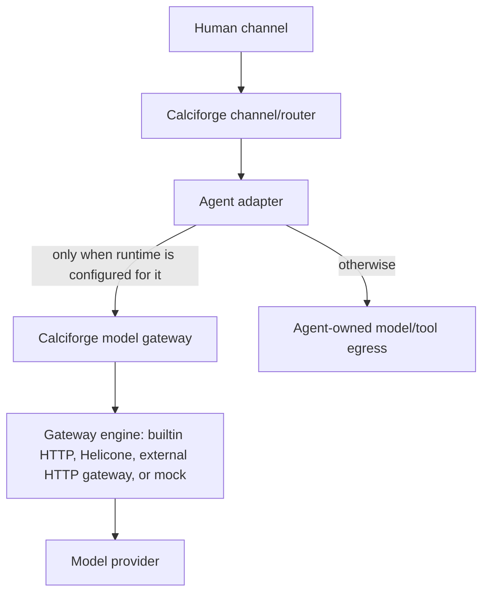

# ADR 0001: Model Gateway And Agent Boundaries

Status: Accepted

Date: 2026-05-08

## Context

Calciforge now sits between human chat channels, downstream agents, a local
model gateway, a security proxy, and optional external gateway engines such as
Helicone. The same words have been used for several different boundaries:

- A channel receives a human message and sends replies.
- An agent adapter controls or talks to a downstream agent runtime.
- The model gateway exposes an OpenAI-compatible `/v1/chat/completions`
  endpoint and owns model aliases, local selectors, alloys, cascades,
  dispatchers, and provider routes.
- The security proxy is an HTTP(S) proxy/MITM path for tool and web traffic
  that is explicitly configured to use it.
- An external gateway engine, currently Helicone, can sit behind Calciforge's
  model gateway for observability and provider routing.

Those surfaces overlap, but they are not interchangeable. A normal
channel-to-agent dispatch does not automatically pass through the model gateway.
It reaches the selected adapter. That adapter may then use Calciforge's model
gateway internally, but only if the agent runtime is configured that way.

## Decision

Calciforge will make the protected model path explicit.

The root model gateway has a small supported backend set:

- `http`: Calciforge's builtin HTTP upstream adapter. It is a minimal
  compatibility path for OpenAI-compatible endpoints, not a mature external
  gateway engine.
- `helicone`: Calciforge forwards through a Helicone AI Gateway process.
- External OpenAI-compatible gateway endpoints such as LiteLLM are currently
  configured as provider routes with `backend_type = "http"` and
  `credential_owner = "gateway"`. In that shape, the builtin HTTP adapter is
  only the transport to the gateway process; the external gateway owns its
  model/provider registry and upstream keys.
- `mock`: deterministic local/test behavior.

Experimental or stale root backends such as `embedded`, `library`, and
`traceloop` are not supported in production config. They can return later only
after they have a real adapter contract, validation, integration tests, and docs.
Subprocess-backed subscription tools such as Codex, Claude, Kimi, Dirac, and
artifact recipes are agents, not gateway models.

The model gateway remains Calciforge's source of truth for public model
selectors. User-facing model names flow through one resolver path for shortcut
aliases and synthetic selectors before routing reaches a terminal provider
model. Agent selectors and model selectors are separate namespaces and should
be validated as such.

`!model` applies only to agents that explicitly consume Calciforge model
overrides. Agents with native command/model/session semantics should use their
own adapter contract unless their runtime is configured to call Calciforge's
model gateway for inference.

The security proxy is a separate egress boundary. It can protect agent tools and
provider web-fetch paths only when the relevant process or provider route is
configured to use it, and when HTTPS clients trust the Calciforge MITM CA.

## Consequences

Operators get fewer false promises:

- `!gateway` and docs describe the model gateway, not every downstream agent.
- `!agents`, `doctor`, and future UX should report each agent's coverage:
  model-gateway path, security-proxy path, model override support, session
  support, and known bypasses.
- External gateways add observability and provider management behind
  Calciforge, but they do not replace Calciforge's channel, identity, command,
  policy, alias, and routing responsibilities.

This also narrows supported configuration. Configs that used
`backend_type = "embedded"`, `backend_type = "library"`, or
`backend_type = "traceloop"` as the root `[proxy]` backend must move to `http`,
`helicone`, or `mock`, or use an agent adapter/recipe instead.

## Follow-Up Refactor Plan

1. Keep root gateway backend validation and runtime startup on the same
   allowlist.
2. Remove stale gateway spike code from the production build; future gateway
   experiments must return behind explicit experimental modules with their own
   adapter contract and tests.
3. Extend `doctor` and chat-visible agent details with per-agent coverage:
   model gateway, security proxy, model override, session, artifacts, and native
   commands.
4. Replace hard-coded model fallback lists with config-derived model registry
   data wherever possible.
5. Add production-path tests for the boundaries:
   channel to model-gateway-backed `openai-compat`, channel to native agent,
   and channel to subprocess agent with explicit security-proxy/env coverage.

## Follow-Through

2026-05-08: The production code path now exposes only the shared root gateway
allowlist (`http`, `helicone`, and `mock`). The old Traceloop feature module and
unimplemented embedded/library backend stubs were removed so validation,
runtime startup, and selectable gateway engine types cannot drift apart around
unsupported names.
