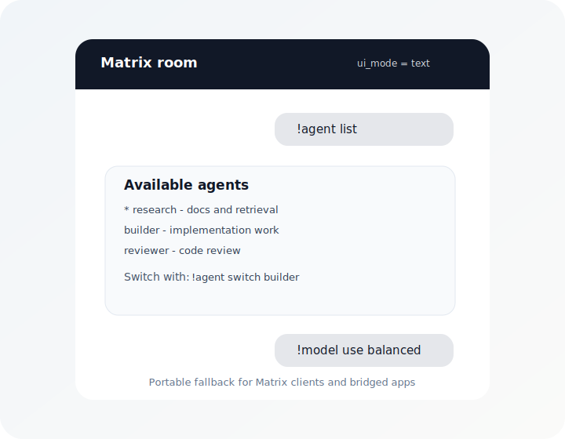
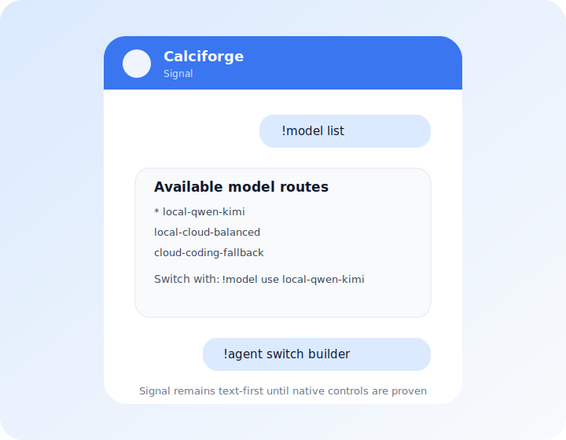

# Channel-Native UI

Calciforge keeps text commands as the portable interface, then adds native
controls when a channel can render them reliably. A button press, list choice,
or form link must call the same backend command handler as the text command so
the behavior stays identical across direct clients, bridged clients, and
text-only channels.

The channel with the best controls does not have to be the channel where the
conversation happens. For example, an operator can keep Telegram open as a
Calciforge control panel for `!agent`, `!model`, and `!secret` flows while
chatting with the same routed agent over Matrix, WhatsApp, Signal, or SMS.
Active agent and model selections are keyed by Calciforge identity, so the
operator's choices follow them across channels.

Use `ui_mode = "auto"` to allow native controls where supported. Use
`ui_mode = "text"` when a client or bridge renders native controls poorly, such
as WhatsApp through a Matrix bridge.

## Rendered Mockups and Targets

These illustrations are rendered mockups for docs and planning. They show the
intended user experience and the current implementation boundary; they are not
captured screenshots from Telegram, Matrix, Signal, or WhatsApp clients unless
explicitly labeled that way.

  <figure>
    
    <figcaption>Telegram can render agent choices as inline buttons.</figcaption>
  </figure>
  <figure>
    
    <figcaption>Model routes use the same command backend as <code>!model use &lt;id&gt;</code>.</figcaption>
  </figure>
  <figure>
    
    <figcaption>Matrix currently uses deterministic text fallback for bridge-safe operation.</figcaption>
  </figure>
  <figure>
    
    <figcaption>Signal is high priority, but remains text-first until native controls are proven.</figcaption>
  </figure>
  <figure>
    
    <figcaption>WhatsApp native lists/buttons are a target, not current embedded-channel behavior.</figcaption>
  </figure>

## Capability Model

| Capability | Native examples | Text fallback |
|---|---|---|
| Choice | Telegram inline keyboard, WhatsApp list/reply buttons, RCS suggested replies | Numbered options plus `!agent switch <id>` or `!model use <id>` |
| URL/form | Telegram URL button, RCS open URL action | Plain HTTPS link |
| Confirm | Yes/no quick replies or buttons | `!approve <id>` / `!deny <id>` |
| Artifact | Native image, audio, video, or file delivery | Artifact name, size, and safe next action |

## Channel Notes

- Telegram: implemented for agent/model selection and paste-form links.
- Matrix: keep text-first until native polls/buttons are proven across Element,
  Beeper, and bridges.
- Signal: high priority for richer controls where the transport exposes safe
  affordances; keep the same text fallback as Matrix until direct support is
  proven.
- WhatsApp: the embedded WhatsApp Web channel is text/media-first today. Native
  list or reply-button support should be tied to a backend that exposes
  WhatsApp interactive messages.
- SMS: text-only. RCS can support suggested replies/actions through RCS Business
  Messaging providers, but that is a separate rich capability from plain SMS.
- iMessage: useful in theory, but long-term support depends on a provider or
  Apple Messages for Business-style path rather than assuming BlueBubbles will
  stay stable.
