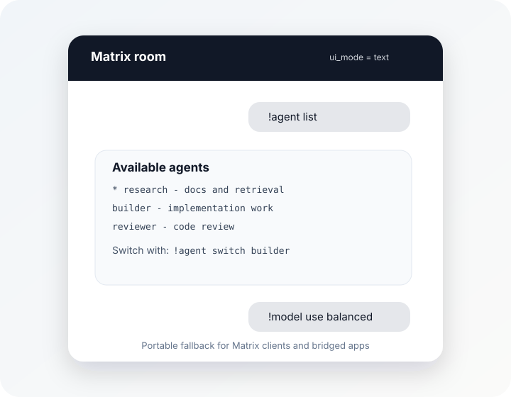

# Matrix Channel

Calciforge connects to Matrix through the [Client-Server API v3](https://spec.matrix.org/v1.9/client-server-api/)
using **HTTP long-polling** (`/sync`). Long-polling means Calciforge keeps
asking the homeserver for new events, so no webhook endpoint or open firewall
port is required.

> **No end-to-end encryption yet.** The Matrix channel currently uses the raw
> Matrix Client-Server API, so it receives plaintext `m.text` events and sends
> plaintext replies plus native media events for agent artifacts. Matrix itself
> supports end-to-end encryption, and the Matrix Rust SDK has crypto support,
> but Calciforge has not yet wired the required encrypted-room client state,
> device trust, and persistent crypto store. Do not use this channel in rooms
> where E2EE is required.

## Architecture

```
Matrix user  ──→  homeserver  ──→  Calciforge (/sync long-poll)
                                          │
                                  identity resolution
                                  (allowed_users check)
                                  agent dispatch
                                          │
Matrix user  ←──  homeserver  ←──  Calciforge (PUT /send/m.room.message, media upload)
```

## Prerequisites

1. **Register a Matrix account** for the bot on your homeserver (or matrix.org for testing).
   The account does not need to be a human account — a plain `@calciforge-bot:example.com`
   works fine.
2. **Generate an access token** for that account:

```bash
curl -s -X POST 'https://matrix.example.com/_matrix/client/v3/login' \
  -H 'Content-Type: application/json' \
  -d '{
    "type": "m.login.password",
    "user": "@calciforge-bot:example.com",
    "password": "botpassword"
  }' | grep access_token
```

   Copy the `access_token` value from the response and store it like a
   password. Access tokens are not decorative boilerplate; they are the key to
   the bot account.

3. **Find the room ID** for the room you want the bot to listen in:
   - In most clients: room settings → Advanced → Internal room ID
   - Format: `!abc123def456:example.com`
   - The bot will auto-accept room invites from users listed in `allowed_users`

## Step 1: Save the access token

```bash
install -m 600 /dev/null ~/.config/calciforge/secrets/matrix-token
printf '%s' 'syt_YOUR_ACCESS_TOKEN_HERE' > ~/.config/calciforge/secrets/matrix-token
```

## Step 2: Channel config

Add to `~/.config/calciforge/config.toml`:

```toml
[[channels]]
kind = "matrix"
enabled = true
homeserver = "https://matrix.example.com"
access_token_file = "~/.config/calciforge/secrets/matrix-token"
room_id = "!abc123def456:example.com"
allowed_users = ["@operator:example.com"]
```

| Field | Required | Description |
|---|---|---|
| `homeserver` | yes | Full URL of the Matrix homeserver |
| `access_token_file` | yes | Path to file containing the bot's access token |
| `room_id` | yes | Internal room ID (starts with `!`) |
| `allowed_users` | yes | Matrix user IDs permitted to send commands; use `["*"]` to allow all room members; empty list is rejected at startup |
| `ui_mode` | no | `"auto"` by default; set `"text"` to disable channel-native UI experiments and keep text-only replies for bridged clients |
| `scan_messages` | no (`false`) | Enable inbound adversarial content scanning |
| `allow_chat_secret_set` | no (`false`) | Allow `!secret set` / `!secure set` via Matrix (not recommended) |

## Step 3: Identity config

The alias `id` is the full Matrix user ID including homeserver:

```toml
[[identities]]
id = "operator"
display_name = "Alice"
role = "admin"
aliases = [
    { channel = "matrix", id = "@alice:example.com" },
]

[[routing]]
identity = "operator"
default_agent = "primary-agent"
allowed_agents = ["primary-agent"]
```

Messages from Matrix users not in `allowed_users` are ignored before identity resolution.
Messages from `allowed_users` members with no matching identity alias are also dropped.

## Step 4: Invite the bot

Invite `@calciforge-bot:example.com` to the room. Calciforge will auto-accept the invite
if the inviting user's Matrix ID is in `allowed_users`.

## Step 5: Verify

```bash
calciforge doctor   # validates config
calciforge          # start; send a message in the room
```

The bot responds to commands (`!help`, `!ping`, `!agent list`,
`!agent switch <agent>`, `!model list`, `!secret input NAME`, etc.) and routes
other messages to the default agent for the sender's identity. Legacy shortcuts
such as `!agents`, `!switch`, and `!secure` remain supported.

Matrix support currently treats text commands as the portable interface. Agent
choices, model choices, session lists, and approval decisions all render through
the shared choice model, but the Matrix adapter sends the text fallback today.
Some Matrix clients and bridges expose buttons or polls differently, and
bridges such as Beeper may not support the downstream app's native controls.
Use `ui_mode = "text"` in `[[channels]]` to force plain text for a channel;
`ui_mode = "auto"` is reserved for channel-native affordances once the Matrix
adapter can expose them without breaking bridged clients. Plain text is not as
flashy, but it behaves predictably across the moving castle of Matrix clients.

You can still use a richer channel, such as Telegram, as the Calciforge control
surface for agent/model selection while keeping Matrix as the main chat room.
Selections are keyed by Calciforge identity and apply across that operator's
channels.

E2EE support is a high-priority follow-up, not a philosophical objection. The
likely path is to move this adapter onto the Matrix Rust SDK crypto stack,
persist the bot device's encrypted state, and add a real encrypted-room smoke
test. Until that lands, treat Matrix as convenient self-hosted transport rather
than the secure-room option it should become.

<div class="channel-ui-grid">
  <figure>
    
    <figcaption>Matrix currently favors bridge-safe text fallback.</figcaption>
  </figure>
</div>

Agent replies that include artifacts are uploaded through the Matrix media API
and sent as native `m.image`, `m.audio`, `m.video`, or `m.file` events. If media
upload fails, Calciforge sends the safe text fallback with artifact names and
sizes instead of exposing local artifact paths.
