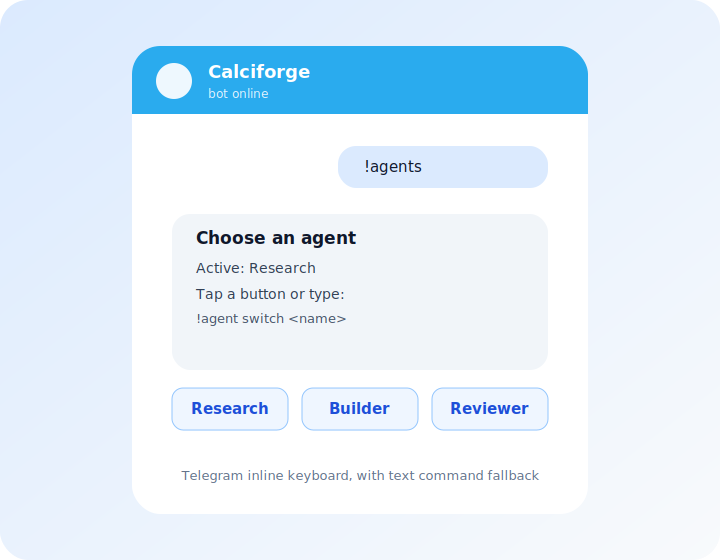
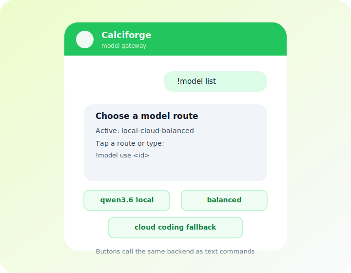

# Telegram Channel

Calciforge connects to Telegram via the [Telegram Bot API](https://core.telegram.org/bots/api)
using **long-polling** — no public webhook endpoint or open firewall port required.

## Architecture

```
Telegram user  ──→  Telegram Bot API  ──→  Calciforge (long-poll)
                                                   │
                                       identity resolution
                                       agent dispatch
                                                   │
Telegram user  ←──  Telegram Bot API  ←──  Calciforge reply/media
```

## Prerequisites

1. **Create a bot** via [@BotFather](https://t.me/BotFather): send `/newbot`, follow the
   prompts, copy the token it returns (format: `1234567890:ABCDEFghijklmnopqrstuvwxyz01234567`)
2. **Find your Telegram user ID** (numeric, not your username):
   - Send any message to your new bot, then run `calciforge` — the user ID appears in logs
     on the first unrecognised message
   - Or send a message to [@userinfobot](https://t.me/userinfobot) — it replies with your ID

## Step 1: Save the bot token

Write the raw token string (no extra whitespace) to a file readable only by the Calciforge
process:

```bash
install -m 600 /dev/null ~/.config/calciforge/secrets/telegram-token
printf '%s' '1234567890:ABCDEFghijklmnopqrstuvwxyz01234567' \
  > ~/.config/calciforge/secrets/telegram-token
```

## Step 2: Channel config

Add to `~/.config/calciforge/config.toml`:

```toml
[[channels]]
kind = "telegram"
enabled = true
bot_token_file = "~/.config/calciforge/secrets/telegram-token"
```

Optional fields:

| Field | Default | Description |
|---|---|---|
| `scan_messages` | `false` | Enable inbound adversarial content scanning via the security proxy |
| `ui_mode` | `"auto"` | Enable Telegram inline buttons for supported choices such as agent/model selection and paste-form links. Set `"text"` to force plain text replies. |
| `allow_chat_secret_set` | `false` | Allow `!secret set NAME=value` / `!secure set NAME=value` via Telegram chat (not recommended — the value appears in chat history and provider logs) |

## Step 3: Identity config

Each user you want to allow needs an `[[identities]]` entry. The alias `id` is the
**numeric Telegram user ID** — not a username, not a phone number:

```toml
[[identities]]
id = "operator"
display_name = "Alice"
role = "admin"
aliases = [
    { channel = "telegram", id = "7000000001" },
]

[[routing]]
identity = "operator"
default_agent = "research"
allowed_agents = ["research"]
```

Messages from Telegram user IDs not listed in any identity's aliases are silently dropped.

## Step 4: Verify

```bash
calciforge doctor   # validates config before starting
calciforge          # start; send /start to your bot in Telegram
```

On first message from a known identity, you'll see `identity resolved` in the logs and the
bot will route to the default agent. On an unknown user ID, you'll see
`unknown Telegram sender — dropping silently sender_id=<id>` — use that to find the numeric
ID to add to your identity aliases.

Agent replies that include artifacts are sent through Telegram's native media
APIs: images are sent as photos, and other artifact types are sent as documents.
If native media delivery fails, Calciforge sends the safe text fallback with
artifact names and sizes instead of exposing local artifact paths.

When `ui_mode = "auto"`, Telegram replies can include inline buttons for
bounded channel-native actions. `!agent list` and `!model list` show buttons
that select an agent/model through the same backend handlers as the text
commands, and `!secret input NAME` / `!secret bulk` replies include an
`Open paste form` URL button. The plain text command remains in every reply so
operators can disable buttons with `ui_mode = "text"` without losing
functionality.

Telegram also works well as a Calciforge control surface even if the main agent
conversation happens somewhere else. Because active agent/model choices are
stored by Calciforge identity, a selection made with Telegram buttons applies
to the same operator's Matrix, WhatsApp, Signal, or SMS route.

<div class="channel-ui-grid">
  <figure>
    
    <figcaption>Agent selection with inline buttons.</figcaption>
  </figure>
  <figure>
    
    <figcaption>Model route selection with the same backend as text commands.</figcaption>
  </figure>
</div>
