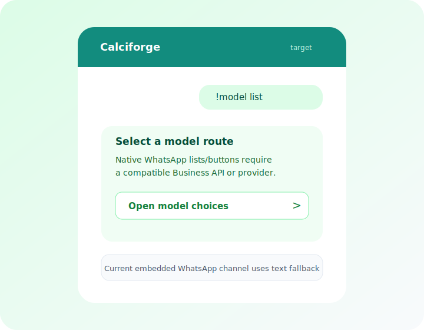

# WhatsApp Channel

Calciforge embeds the `zeroclawlabs::WhatsAppWebChannel` transport directly.
The WhatsApp Web session now lives inside the Calciforge process, so there is
no ZeroClaw/OpenClaw webhook sidecar for this channel.

```text
WhatsApp user  <->  WhatsApp Web session  <->  Calciforge  <->  agent
```

## Requirements

- A WhatsApp account or linked device that can pair with WhatsApp Web.
- Persistent storage for the session database.
- Identity aliases that match incoming phone numbers in E.164 format.

## Configure

```toml
[[channels]]
kind = "whatsapp"
enabled = true
whatsapp_session_path = "~/.config/calciforge/whatsapp/session.db"
allowed_numbers = ["+15555550001"]

# Optional pairing-code login. Use digits only.
# whatsapp_pair_phone = "15555550001"

# Optional personal-mode controls.
# whatsapp_mode = "personal"
# whatsapp_dm_policy = "allowlist"
# whatsapp_group_policy = "allowlist"
# whatsapp_mention_only = false
# whatsapp_self_chat_mode = false
# whatsapp_group_mention_patterns = ["@Calciforge", "calciforge"]

# Optional security scan for inbound messages.
# scan_messages = true
```

```toml
[[identities]]
id = "operator"
display_name = "Operator"
role = "owner"
aliases = [
  { channel = "whatsapp", id = "+15555550001" },
]
```

## Pair

Start Calciforge with the channel enabled. On first run, the embedded transport
will create or open the configured session database and initiate WhatsApp Web
pairing. Keep `whatsapp_session_path` on durable storage so restarts reuse the
same linked session.

## Verify

```bash
calciforge doctor
calciforge
```

Send `!ping` from an allowed WhatsApp number. Replies go to the transport
`reply_target`, so direct chats and group chats reply to the original
conversation.

## Channel UI

The embedded WhatsApp Web channel is text/media-first today. It should keep the
same deterministic text commands as Matrix and Signal until the backend exposes
WhatsApp interactive messages safely. If a future WhatsApp Business API or
provider-backed channel supports lists or reply buttons, Calciforge can render
the same agent/model choices natively while preserving text fallback.

Operators can use Telegram as the Calciforge control surface for buttons while
continuing the main chat in WhatsApp. Active agent/model selections are keyed by
Calciforge identity, so choices made through Telegram apply to the same
operator's WhatsApp route.

<div class="channel-ui-grid">
  <figure>
    
    <figcaption>Native WhatsApp lists/buttons are a backend-dependent target, not the embedded channel behavior today.</figcaption>
  </figure>
</div>

## Migration

The legacy webhook fields are rejected for `kind = "whatsapp"`:

```toml
zeroclaw_endpoint = "http://127.0.0.1:18789"
zeroclaw_auth_token = "..."
webhook_listen = "0.0.0.0:18795"
webhook_path = "/webhooks/whatsapp"
webhook_secret = "..."
```

Move the session into Calciforge with `whatsapp_session_path` and remove the
sidecar webhook settings.
