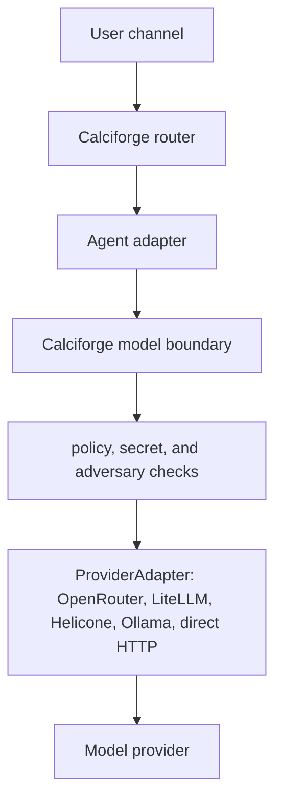
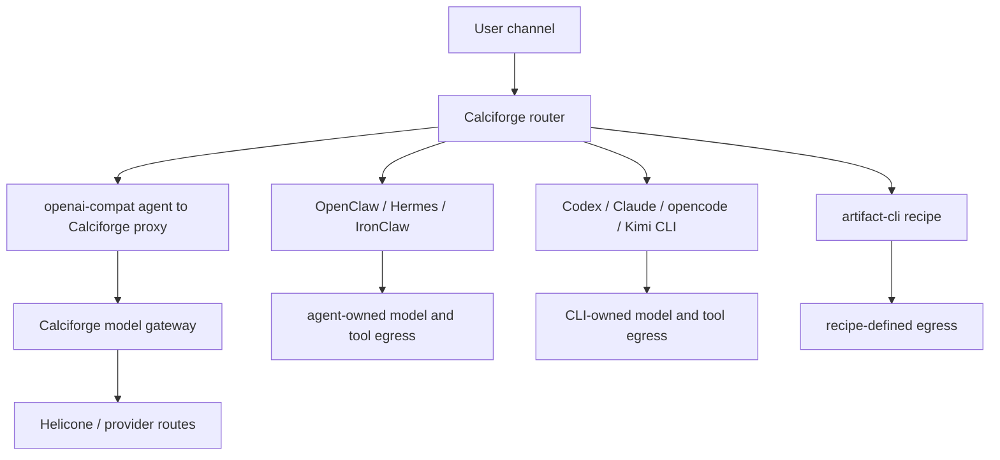

# Model Boundary And Provider Adapters

Calciforge can expose an OpenAI-compatible local endpoint while routing
requests across upstream providers, local models, aliases, and synthetic
model choices.

The product boundary is not a singular gateway implementation. Calciforge owns
the model access boundary: authentication, identity, per-agent model policy,
auditing, aliases, synthetic selectors, and route selection. Concrete model
traffic then exits through one or more configured `ProviderAdapter`s, such as
Ollama, OpenRouter, LiteLLM, Helicone, or a direct OpenAI-compatible endpoint.

Operational installs should choose at least one explicit provider adapter.
`mock` is test-only and there is intentionally no built-in public-provider
default. Installer recipes may offer convenience setup for adapters such as
Helicone or OpenCode, but those are adapter choices, not Calciforge's required
runtime architecture.

For the architecture boundary between channels, agents, the model boundary, the
security proxy, and provider-owned boundaries, see
[ADR 0001: Model Gateway And Agent Boundaries](adr/0001-model-gateway-and-agent-boundaries.html).

Agents can also point at an OpenAI-compatible endpoint with
`kind = "openai-compat"`. Use that for plain model-gateway or model API
targets. Do not use it as an OpenClaw agent adapter; OpenClaw agents should use
`kind = "openclaw-channel"` so slash commands and agent identity stay native.
Set `allow_model_override = true` only for OpenAI-compatible agents that should
accept Calciforge `!model` selections and gateway model selectors. Leave it unset
for endpoints with their own restricted model namespace.

From a user-experience perspective, keep model routes separate from agents.
Agents own runtime identity, commands, tools, sessions, approvals, memory, and
artifacts. Model routes are just chat/model endpoints. They can be useful for a
simple chatbot lane or dispatcher testing, but they should be shown as "models"
or "chat routes" rather than as full agents in user-facing lists.

## Traffic Boundaries

The intended protected model path is:



That path is real only when the selected adapter sends model requests to
Calciforge's own `[proxy]` endpoint. An `openai-compat` agent whose `endpoint`
points at the local Calciforge proxy does this. OpenClaw, Hermes, IronClaw,
ACP/ACPX, Codex CLI, Claude CLI, Kimi CLI, opencode CLI, and recipe
subprocesses are agent adapters; they do not automatically put their internal
provider or tool traffic through the model gateway.

Those adapters can still be useful, but their protection and observability
depend on runtime-specific wiring:



Run `calciforge doctor` after config changes. Its per-agent coverage lines
state whether each agent is using the model gateway, whether `!model` overrides
are enabled, and whether security-proxy coverage is configured or unknown. It
also validates configured provider adapters and referenced provider key files, and
reports stale persisted `!model` overrides that no longer point at a configured
gateway selector. Doctor also resolves the configured model route graph for
alloys, cascades, dispatchers, exact routes, and shortcuts. When a selector
falls through to the legacy root adapter instead of an explicit provider route, it
warns because that path bypasses provider-specific prefixes, API keys, and
`on_switch` hooks.

## What Exists Today

| Feature | Status | Notes |
|---|---:|---|
| OpenAI-compatible `/v1/chat/completions` proxy | Working | Local endpoint forwards to configured providers. |
| Provider pattern routing | Working | `[[proxy.providers]]` model globs map model names to upstream APIs. Provider `on_switch` hooks can prepare single-resident local runtimes before a request. |
| Explicit model routes | Working | `[[proxy.model_routes]]` overrides provider pattern matching. |
| Model shortcuts | Working | `[[model_shortcuts]]` gives users short aliases such as `sonnet`. |
| Local model switching | Working | `[local_models]` manages local `mlx_lm.server` targets. |
| Alloys | Working | `[[alloys]]` samples among interchangeable constituents by `weighted` or `round_robin` strategy, with context-window safety checks. |
| Fallback behavior | Working, implicit | Alloy execution produces an ordered attempt plan; later constituents are tried when earlier ones fail. |
| Named cascades | Working | `[[cascades]]` defines explicit ordered fallback chains and skips targets whose declared context window cannot fit the request. |
| Dispatchers | Working | `[[dispatchers]]` picks the smallest configured context window that fits, then uses larger eligible models as fallbacks. |
| Token estimators | Working | `char_ratio`, `byte_ratio`, and optional `tiktoken-rs` support for OpenAI-compatible BPE counts. |
| CLI-backed subscription agents | Working | Codex, Claude Code, Kimi Code, Dirac, and generic executable adapters are agent routes, not gateway model selectors. |
| External gateway metadata | Working | `/gateway`, `/gateway/ui`, and `!gateway` expose the selected gateway engine and operator dashboard link after sender identity resolution. |
| Helicone external gateway adapter | Working | `backend_type = "helicone"` forwards OpenAI-compatible requests to a Helicone AI Gateway while preserving Calciforge auth, routing, and command UX. |
| Builtin HTTP upstream adapter | Compatibility path | `backend_type = "http"` uses Calciforge's minimal OpenAI-compatible HTTP client. It is useful for tests, local development, and explicit operator escape hatches, but it is not equivalent to a mature gateway engine such as Helicone or LiteLLM. |

## External Provider Adapters

Calciforge's gateway layer is pluggable at the engine boundary. The built-in
`mock` engine is for tests. The built-in `http` engine is a minimal upstream
adapter: it sends OpenAI-compatible HTTP requests directly from Calciforge to a
configured endpoint. Treat it as a compatibility path, not as a peer to mature
gateway engines. External engines such as Helicone and LiteLLM can add
operator-facing dashboards, provider registries, virtual keys, retries, load
balancing, and provider-specific request translation without changing how
channels and agents talk to Calciforge.

Calciforge intentionally treats external provider-boundary model IDs as opaque
when that boundary owns provider configuration. OpenRouter, Helicone, and
LiteLLM all support provider/key/model registries; Calciforge should not
duplicate that registry when the operator has chosen that shape. In Calciforge config, set
`model_credential_owner = "provider"` on the provider route. The provider's
`api_key`/`api_key_file`, if present, then authenticates Calciforge to the
provider boundary; it is not the upstream OpenAI, Anthropic, Ollama, or other
final provider key.

```toml
[[proxy.providers]]
id = "managed-gateway"
backend_type = "http"
url = "http://127.0.0.1:4000/v1"
model_credential_owner = "provider"
api_key_file = "/etc/calciforge/secrets/managed-gateway-client-key"
models = ["managed/*"]
```

In that shape, `backend_type = "http"` is just the transport used to reach a
provider-owned OpenAI-compatible boundary endpoint. `model_credential_owner = "provider"`
is the important ownership boundary: `managed/default`, `managed/cheap`, or
`managed/coding` are Calciforge-visible selectors but provider-owned model names.
Calciforge still owns aliases, synthetic selectors, access policy, sender
identity, security scanning, and command UX. The external gateway owns upstream
provider API keys, provider-specific model IDs, load balancing, and any
dashboard-native model registry. Use multiple Calciforge providers pointing at
the same gateway URL when different public prefixes need different
`strip_model_prefix` or `add_model_prefix` translations.

Set `model_credential_owner = "calciforge"` only when Calciforge owns and presents
the final upstream model-provider credential. That credential should normally
live in fnox or a `model_api_key_file`, not inline TOML. Direct upstream routes
may keep using `api_key`/`api_key_file` as a compatibility spelling when
endpoint auth and final model auth are the same bearer token, but new configs
should use the explicit model credential fields when those concepts differ.
This is intentionally separate from substitution-protected fnox secrets because
agents should never need to request these model-provider credentials directly.

Current built-in HTTP/Helicone adapters have one first-class bearer credential
slot. Do not configure both provider endpoint auth (`api_key`/`api_key_file`)
and Calciforge-owned final model auth (`model_api_key`/`model_api_key_file`) on
the same provider route unless that adapter has a documented second auth
channel. For direct upstream providers, use `model_api_key_file`. For external
gateway boundaries such as LiteLLM, OpenRouter, or Helicone, use
`model_credential_owner = "provider"` and put the gateway/client credential in
`api_key_file`.

Set `model_credential_owner = "provider"` when the configured provider boundary owns
upstream credentials, virtual keys, model routing, or BYOK state, such as
Helicone, LiteLLM, or OpenRouter. In that shape, any `api_key`/`api_key_file`
authenticates Calciforge to that boundary, not to the final upstream model
provider.

Use `model_credential_owner = "provider"` for local unauthenticated providers
such as loopback Ollama too: the important point is that Calciforge does not own
final upstream model credentials for that adapter route. Provider adapter
endpoint auth remains separate and may still be absent or present.

Older configs using `model_credential_owner = "gateway"`,
`model_credential_owner = "none"`, or `credential_owner = ...` are still
accepted as compatibility aliases, but new configs should use
`model_credential_owner = "provider"` or `"calciforge"`.

Provider routes can also set fixed upstream headers and OpenAI-compatible JSON
body extensions. Headers are intentionally operator-controlled: some providers
require a client identity, partner identifier, beta flag, or compatibility
header, and local deployments may need to reproduce the headers that make a
subscription-backed workflow usable through Calciforge. `request_body` is for
provider-specific request fields such as Kimi's `thinking` option. Calciforge
also preserves unknown request fields sent by the caller, but configured
`request_body` values win when the same key is present.

```toml
[[proxy.providers]]
id = "kimi-coding"
backend_type = "http"
url = "https://api.kimi.com/coding/v1"
model_credential_owner = "calciforge"
model_api_key_file = "/etc/calciforge/secrets/kimi-coding-key"
models = ["kimi-for-coding"]
headers = { "User-Agent" = "kimi-cli/1.0" }

[proxy.providers.request_body]
thinking = { type = "disabled" }
```

Calciforge does not judge which provider headers an operator may set. Operators
are responsible for choosing headers that match their provider account,
subscription, and risk tolerance. When a provider offers a native CLI or ACP
path, that route may still be operationally cleaner because it preserves the
provider's expected request shape and session behavior without extra gateway
translation.

Helicone is the first external gateway adapter and the default batteries-included
observability path we ship today. It gives operators a real request dashboard,
provider routing surface, and persisted gateway logs, while Calciforge remains
the local identity, command, alias, alloy, dispatcher, and policy boundary.
That convenience has a cost: the local stack is heavier than a plain HTTP
forwarder because it includes dashboard, Postgres, ClickHouse, Jawn, and
S3-compatible object storage pieces. A lighter external gateway or a smaller
Calciforge-native observability engine may be desirable later; the adapter
boundary is intentionally where future PRs can plug in those alternatives.

Calciforge's installer can
provision a local Helicone deployment when `CALCIFORGE_HELICONE_ENABLED=true`.
The tested local setup uses Helicone's all-in-one Docker image for the
dashboard, bundled MinIO S3-compatible storage, and Jawn API, plus the standalone
`@helicone/ai-gateway` package for request routing. The standalone gateway is
intentional: current all-in-one images may start a bundled gateway supervisor
that exits before routing traffic.
The installer pins the dashboard image with `CALCIFORGE_HELICONE_IMAGE`
(`helicone/helicone-all-in-one:v2025.08.21` by default) so local installs do
not drift when upstream retags `latest`.

Configure Calciforge manually by setting `backend_type = "helicone"` and
pointing `backend_url` at the Helicone AI Gateway OpenAI-compatible base URL.
`backend_url` must be a plain `http` or `https` base URL without query
parameters or fragments.
If it has no path, Calciforge posts to `/v1/chat/completions`; if it already
includes a path such as `/v1`, `/ai`, or `/router/<name>`, Calciforge appends
`/chat/completions` to that configured base path instead of injecting another
`/v1`.

```toml
[proxy]
enabled = true
bind = "127.0.0.1:8080"
api_key_file = "/etc/calciforge/secrets/model-gateway-client-key"
backend_type = "helicone"
backend_url = "http://127.0.0.1:8787/ai"
backend_api_key_file = "/etc/calciforge/secrets/helicone-gateway-key"
gateway_ui_url = "http://127.0.0.1:3300"
```

### Retry and Fallback Policy

There are two distinct failure-handling layers:

- `[proxy.retry]` retries one concrete provider/gateway attempt.
- `[proxy].fallback_on` controls whether a synthetic selector may advance from
  one planned model to the next model.

Do not treat these as interchangeable. Retry is for transient failures on the
same target. Fallback changes the target and may change quality, cost,
latency, context window, or data residency.

```toml
[proxy]
fallback_on = [
  "timeout",
  "network",
  "rate_limited",
  "server_error",
  "context_exceeded",
]

[proxy.retry]
enabled = true
max_retries = 2
min_timeout_ms = 500
max_timeout_ms = 8000
factor = 2
retry_on = ["timeout", "network", "rate_limited", "server_error"]
```

Provider routes can override both:

```toml
[[proxy.providers]]
id = "local-ollama"
url = "http://127.0.0.1:11434/v1"
model_credential_owner = "provider"
models = ["ollama/*"]
fallback_on = [] # never fall through from this provider

[proxy.providers.retry]
enabled = false
```

The default fallback policy deliberately does not advance on `auth_failed`,
`forbidden`, `model_not_found`, `bad_request`, `misconfigured`, or
`invalid_response`. Those failures usually mean the route, credentials, or
request shape is wrong. Letting a dispatcher silently continue would hide the
configuration bug and make gateway logs misleading.

For Helicone providers, Calciforge maps retry settings to Helicone retry
headers, because retry is an engine feature there. Calciforge does not then
retry the same Helicone request locally; that would multiply attempts and
costs. For builtin HTTP upstream routes, Calciforge applies the retry policy
itself.

For a LAN-visible local dashboard during install:

```bash
CALCIFORGE_HELICONE_ENABLED=true \
CALCIFORGE_HELICONE_DASHBOARD_ENABLED=true \
CALCIFORGE_HELICONE_DASHBOARD_BIND=0.0.0.0 \
CALCIFORGE_HELICONE_DASHBOARD_USER_EMAIL=you@example.com \
CALCIFORGE_HELICONE_DASHBOARD_PASSWORD_FILE=/path/to/dashboard-password \
bash scripts/install.sh --yes
```

The default dashboard bind is `127.0.0.1`. Use `0.0.0.0` only on a trusted LAN
or behind WireGuard. Bind addresses decide where local services listen; they
are not necessarily the URLs users should click from another device.

The all-in-one image includes MinIO, which is the default local storage backend
for request/response bodies. For LAN dashboards, the browser-visible runtime
environment must expose LAN URLs for both Jawn and S3-compatible storage;
otherwise the page can load while request lists or bodies silently call the
client machine's `localhost`. The installer patches Helicone's `__ENV.js` for
this all-in-one path. Managed S3, Garage, SeaweedFS, or another S3-compatible
service can be used by operating Helicone separately and setting its storage
environment variables there; Calciforge then only needs `[proxy].gateway_ui_url`
and `backend_url` pointed at that deployment.

After installing or repairing the local Helicone stack, run the focused doctor
to verify the same path a remote browser uses:

```bash
CALCIFORGE_HELICONE_DASHBOARD_USER_EMAIL=you@example.com \
CALCIFORGE_HELICONE_DASHBOARD_PASSWORD_FILE=/path/to/dashboard-password \
CALCIFORGE_HELICONE_REQUIRE_VISIBLE_ROWS=true \
scripts/helicone-doctor.sh
```

The script checks the dashboard URL, browser-visible Jawn/S3 endpoints,
published ports, dashboard credential account, gateway API-key permissions,
ClickHouse rows visible to the configured dashboard user's organization, and
the same Jawn request-list API that the dashboard calls after login. If
`CALCIFORGE_HELICONE_REQUIRE_VISIBLE_ROWS=true`, the doctor fails until at least
one gateway request is actually visible to the dashboard user.

The Helicone doctor is deliberately narrower than `calciforge doctor`: it is a
gateway-stack smoke test for the browser path, including the failure mode where
the dashboard loads on another machine but its runtime config still points at
that browser's own `localhost`.

When a dashboard user email is provided, the installer attaches the local
gateway API key to that user's Helicone organization. It creates or repairs the
credential account only when `CALCIFORGE_HELICONE_DASHBOARD_PASSWORD` or
`CALCIFORGE_HELICONE_DASHBOARD_PASSWORD_FILE` is set; otherwise it only attaches
to an existing dashboard user and falls back to the service-owned local org.
The local gateway key is seeded with read/write permissions because Helicone's
AI Gateway needs read access to its control-plane signed-URL endpoint before it
can persist request/response bodies.

Set `gateway_ui_url` to the externally reachable dashboard URL you operate,
such as a Tailscale MagicDNS name, Tailscale IP, WireGuard address, or
authenticated reverse-proxy URL:

```toml
[proxy]
gateway_ui_url = "https://calciforge-gateway.example.invalid"
```

The installer writes the same setting from `CALCIFORGE_GATEWAY_UI_URL` and
does not require Calciforge to own the tunnel, DNS name, certificate, firewall,
or reverse proxy. If `CALCIFORGE_GATEWAY_UI_URL` is unset, the installer only
records a local dashboard URL when it actually starts the local dashboard
container. When a dashboard URL is configured, `!gateway` and `/gateway` expose
it so the operator can jump from Calciforge into Helicone's observability UI.

Use the same pattern for other local web surfaces: keep the service bind
conservative, then configure the advertised public URL separately. Paste-server
links use `CALCIFORGE_PASTE_PUBLIC_BASE_URL` for reverse proxies or tunnels and
`CALCIFORGE_PASTE_PUBLIC_HOST` for a stable LAN/Tailscale host.

The Helicone gateway is currently strongest for providers that Helicone knows
how to route directly, such as Ollama via the `/ai` router with
provider-qualified model IDs. Keep user-facing local selectors such as
`qwen3.6:27b` in Calciforge, then set `add_model_prefix = "ollama/"` on the
Helicone provider so upstream requests send `ollama/qwen3.6:27b`. Arbitrary
OpenAI-compatible providers may still be configured through Calciforge's builtin
HTTP upstream adapter until their Helicone provider/converter support is
validated, but that should be treated as an explicit compatibility path.

Large local Ollama models usually cannot stay resident together. For Ollama
providers, configure `on_switch` so Calciforge unloads any other resident model
before it forwards the next provider request:

```toml
[[proxy.providers]]
id = "helicone-ollama"
backend_type = "helicone"
url = "http://127.0.0.1:8787/ai"
api_key_file = "/etc/calciforge/secrets/helicone-gateway-key"
models = []
add_model_prefix = "ollama/"
on_switch = "calciforge-ollama-switch"
timeout_seconds = 900
```

The source installer writes `calciforge-ollama-switch` when Helicone is enabled,
and release archives/Homebrew installs include the helper under `bin/`. The hook
receives `CALCIFORGE_PROVIDER_ID`, `CALCIFORGE_MODEL_ID`,
`CALCIFORGE_UPSTREAM_MODEL_ID`, and `CALCIFORGE_PREV_MODEL_ID`. `!model` only
stores the selected model for the sender identity; provider hooks run
synchronously before the next gateway request that uses that provider.
Calciforge serializes switches per provider, applies the hook to dispatcher and
cascade fallback attempts, and fails that provider attempt if the hook exits
non-zero or times out. Dispatchers, cascades, and alloys may still try later
fallback constituents when their routing plan allows it; a direct request with
no fallback fails the whole request.

For service installs, verify the hook can find the runtime binary in the
service environment, not only in an interactive shell. Ollama.app commonly
installs its CLI at `/usr/local/bin/ollama` on Apple Silicon Macs even when
Calciforge itself was installed by Homebrew under `/opt/homebrew`. The bundled
`calciforge-ollama-switch` checks common Homebrew, `/usr/local/bin`, and
Ollama.app paths explicitly so packaged services can still run the hook with a
minimal service `PATH`.

Provider `on_switch` hooks are different from `[local_models]` lifecycle hooks.
Use `[local_models.mlx_lm.hooks]` when Calciforge owns a local `mlx_lm.server`
process. Use `[[proxy.providers]].on_switch` when an external runtime such as
Ollama owns model residency and Calciforge only needs to prepare that runtime
before forwarding an OpenAI-compatible request.

`!gateway` is handled only after a channel resolves the sender identity. It can
include internal bind addresses or dashboard URLs, so room-based channels and
future pairing flows should keep their own authorization semantics rather than
reusing trusted-owner DM assumptions.

For process-boundary coverage, run:

```bash
python3 scripts/model-gateway-helicone-smoke.py
```

That script starts a local Helicone-shaped gateway, starts Calciforge in
`--proxy-only` mode, checks `/gateway` metadata and `/gateway/ui`, and sends a
real `/v1/chat/completions` request through Calciforge to prove the adapter
forwards the expected auth headers, path, and model.

For a live deployment smoke against configured provider routes, run:

```bash
scripts/model-gateway-provider-smoke.sh \
  --base-url http://127.0.0.1:18083 \
  --api-key-file ~/.config/calciforge/secrets/proxy-api-key \
  opencode-go/qwen3.6-plus
```

That script sends requests through Calciforge's provider boundary endpoint and fails if
any listed model cannot return the exact expected response. Use it for operator
validation after adding provider API-key files, model prefixes, or route blocks.

## OpenCode Go and Zen

OpenCode exposes two related gateway surfaces that share account/API-key
management but should be configured as different Calciforge providers:

- **OpenCode Go**: subscription-backed open coding models at
  `https://opencode.ai/zen/go/v1/chat/completions`. Prefer this for default
  Calciforge dispatchers when a Go subscription is available.
- **OpenCode Zen**: pay-as-you-go curated models at
  `https://opencode.ai/zen/v1/...`. Do not default to this unless the operator
  explicitly opts in; it draws from Zen balance/credits.

OpenCode's own config names models as `opencode-go/<model-id>` for Go. In
Calciforge, keep Zen separate with a distinct prefix such as
`opencode-zen/<model-id>`. The OpenAI-compatible endpoint expects the
unprefixed model ID in both cases. Calciforge providers therefore support
`strip_model_prefix` so user-facing selectors remain namespaced while upstream
requests send the provider's concrete model ID.

Calciforge's model gateway currently speaks the OpenAI-compatible
`/v1/chat/completions` request shape. Use OpenCode Go models that are exposed on
that shape, such as Kimi and Qwen. Models that require Anthropic-compatible
`/v1/messages` are not supported by the builtin HTTP upstream adapter yet; route
them through a CLI, ACP adapter, LiteLLM, or another gateway that converts
OpenAI-compatible requests to Anthropic-compatible upstream calls.

```toml
[[proxy.providers]]
id = "opencode-go"
backend_type = "http"
url = "https://opencode.ai/zen/go/v1"
api_key_file = "/etc/calciforge/secrets/opencode-api-key"
models = [
  "opencode-go/kimi-k2.6",
  "opencode-go/qwen3.6-plus",
  "opencode-go/deepseek-v4-pro",
]
strip_model_prefix = "opencode-go/"
timeout_seconds = 300

[[proxy.providers]]
id = "opencode-zen"
backend_type = "http"
url = "https://opencode.ai/zen/v1"
api_key_file = "/etc/calciforge/secrets/opencode-api-key"
models = [
  "opencode-zen/qwen3.6-plus",
  "opencode-zen/kimi-k2.6",
  "opencode-zen/minimax-m2.7",
]
strip_model_prefix = "opencode-zen/"
timeout_seconds = 300
```

The installer can add these builtin HTTP upstream routes when explicitly
enabled. Those requests pass through Calciforge policy and alias/synthetic
resolution, but they do not appear in Helicone or LiteLLM dashboards unless the
route points at one of those gateways:

```bash
CALCIFORGE_OPENCODE_API_KEY_FILE=/etc/calciforge/secrets/opencode-api-key \
CALCIFORGE_OPENCODE_GO_ENABLED=true \
CALCIFORGE_OPENCODE_GO_MODELS=kimi-k2.6,qwen3.6-plus,deepseek-v4-pro \
bash scripts/install.sh --yes
```

This routes requests through Calciforge's model gateway. It does not guarantee
that Helicone sees the same requests unless the provider is configured through a
Helicone AI Gateway route as well. Treat that as a separate gateway-engine
integration task rather than silently assuming builtin HTTP upstream traffic
appears in Helicone dashboards.

## Model Selection

`!model` has two related surfaces:

- `!model` or `!model list` renders activatable choices for channels that can
  show buttons, with numbered text fallbacks everywhere else.
- `!model use <id>` stores the selected model for the sender identity. Shortcut
  aliases such as `!model sonnet` resolve to their configured target before
  storage. Adapters receive the selected target only when their config
  explicitly allows model overrides.

### Model Identifier Resolution

The gateway treats model identifiers uniformly across direct API calls,
`!model` overrides, routing selectors, and provider routing:

- A model identifier may be a shortcut alias, a synthetic routing selector, a
  local model ID, or a concrete upstream model ID.
- `[[model_shortcuts]]` may target concrete provider models, synthetic routing
  selectors such as dispatchers/cascades/alloys, or local model IDs.
- `[[model_roles]]` are named model selectors for internal Calciforge features
  and recipes. Roles intentionally use the same resolver as shortcuts, so
  `security.screening`, `fast`, or `thinking` may point to a concrete provider
  model, a shortcut, or a synthetic selector. They share the same public
  selector namespace and cycle checks as shortcuts.
- Shortcut aliases are themselves public model IDs. Calciforge rejects aliases
  that collide with configured synthetic routing selectors, local model IDs,
  exact provider model IDs, exact `[[proxy.model_routes]]` patterns, agent IDs,
  or agent aliases.
- Exact model IDs also share the operator-facing selector namespace with agent
  IDs and agent aliases. Calciforge rejects a model route or provider model
  named like an agent selector, because that usually means an agent name has
  been accidentally treated as a concrete gateway model.
- Synthetic routing constituents may also use shortcut aliases. Before provider
  routing, Calciforge expands aliases and nested routing selectors through the
  shared model resolver until the route plan contains terminal gateway model
  IDs. Terminal IDs route to provider gateways or local model endpoints.
- Shortcut cycles and synthetic cycles fail closed instead of falling through to
  a backend as ambiguous model names.
- Proxy model access is checked twice: first for the requested/root model, then
  again for every concrete model in the expanded route plan. `blocked_models`
  therefore applies to concrete downstream models even when a request entered
  through an allowed dispatcher or alias.

Exact model IDs listed in `[[proxy.providers]].models` are activatable choices.
Wildcard patterns such as `openai/*` still route gateway requests, but they are
not shown as tap-to-select model choices because there is no concrete model ID
to activate.

## Synthetic Routing Selectors

Calciforge uses "synthetic routing selector" to mean "a model name that
represents routing logic, not a single upstream model ID." There are three
intended classes: alloys, cascades, and dispatchers. They may reference other
synthetic routing selectors as long as the resulting graph is a DAG; cycles
fail config initialization.

### Alloy

An alloy blends equivalent models. It is useful when any constituent
can answer the request and the operator wants a cost, latency, or
quality mix.

Alloy constituents must be context-compatible. In current code, every
constituent declares `context_window`, and the alloy has an effective
minimum context window. If `min_context_window` is configured, every
constituent must meet or exceed it. If it is omitted, Calciforge
auto-computes the alloy ceiling as the smallest constituent window.
That means mixed-window constituents are allowed only when the alloy
is willing to behave as if it had the smallest window in the group.
For "small request goes local, large request goes remote," use a
dispatcher instead of an alloy.

```toml
[[alloys]]
id = "balanced"
name = "Balanced remote blend"
strategy = "weighted"
min_context_window = 100000

[[alloys.constituents]]
model = "anthropic/claude-sonnet-4.6"
weight = 70
context_window = 200000

[[alloys.constituents]]
model = "openrouter/google/gemini-flash-1.5"
weight = 30
context_window = 100000
```

Current behavior:

- `weighted` samples without replacement for the request.
- `round_robin` rotates the primary constituent.
- every constituent declares `context_window`.
- `min_context_window` is explicit or auto-computed as the minimum
  declared constituent window.
- a constituent below explicit `min_context_window` fails config load.
- the selected model is tried first; remaining constituents become the
  fallback order for that request.

### Cascade

A cascade is an ordered fallback chain: try A, then B, then C on
timeout, 429, 5xx, or other retryable provider failure.

This behavior exists today inside alloy execution, because an alloy
selection returns an ordered list of constituents and the proxy tries
them in order. Named `[[cascades]]` make that behavior explicit
without requiring weighted or round-robin selection. The proxy skips a
cascade target when the request estimate plus output budget exceeds
that target's declared `context_window`.

```toml
[[cascades]]
id = "local-then-remote"
name = "Local first, remote fallback"

[[cascades.models]]
model = "local/qwen3-35b"
context_window = 32768

[[cascades.models]]
model = "anthropic/claude-sonnet-4.6"
context_window = 200000
```

### Dispatcher

A dispatcher chooses a target by request shape. The primary planned
case is "smallest sufficient model": use local/cheap models for small
requests, promote to larger-context or higher-quality models only when
the prompt no longer fits.

The settled name is **dispatcher**, not router, because "router" is
already overloaded by HTTP routing, channel routing, and provider
routing in the codebase.

Dispatchers are implemented as `[[dispatchers]]`. Each target declares
`context_window`; at runtime the gateway estimates the request size,
reserves the requested output budget, and tries the smallest target
that can hold the total. Larger eligible targets become the fallback
order.

```toml
[[dispatchers]]
id = "smart-local"
name = "Use local until the prompt outgrows it"

[[dispatchers.models]]
model = "local/qwen3-35b"
context_window = 32768

[[dispatchers.models]]
model = "openrouter/google/gemini-flash-1.5"
context_window = 100000

[[dispatchers.models]]
model = "anthropic/claude-sonnet-4.6"
context_window = 200000
```

## CLI-Backed Agents

Executable CLIs are Calciforge agents, not model gateway selectors. Use
`kind = "codex-cli"`, `kind = "claude-cli"`, `kind = "kimi-cli"`,
`kind = "dirac-cli"`, `kind = "exec"`, or `kind = "cli"` when a local
subscription-owning CLI should keep its own login, session state, and native
workflow. Those adapters receive chat messages through the normal agent router,
can participate in `!agent` / `!sessions` / `!btw`, and are intentionally kept
out of `/v1/models` so agents and models do not share an ambiguous namespace.

Generic `exec` / `cli` adapters support `{message}`, `{model}`, `{session}`,
and `{session_uuid}` placeholders in args and environment values. First-class
adapters add safer defaults for their CLIs: Codex uses stdin and
`--output-last-message`, Claude Code uses print mode and `--session-id`, and
Kimi Code uses quiet print mode with explicit `--session` plus configurable
thinking flags. Example wrapper scripts live in `scripts/cli-agents/`.

If an OpenAI-compatible client needs access to a subscription-backed model,
prefer a provider route through a real gateway or a dedicated OpenAI-compatible
agent endpoint. Do not model local CLIs as gateway models unless that boundary
has been reintroduced deliberately with a clear observability and security
contract.

## Config Example

```toml
[proxy]
enabled = true
bind = "127.0.0.1:8080"
backend_type = "http"
backend_url = ""

# Operational deployments should prefer explicit provider adapters. The legacy
# root adapter remains only as a compatibility fallback.

[[proxy.providers]]
id = "direct-openai"
backend_type = "http"
url = "https://api.openai.com/v1"
model_credential_owner = "calciforge"
model_api_key_file = "/etc/calciforge/secrets/openai-key"
models = ["openai/*", "gpt-*"]

[proxy.token_estimator]
strategy = "auto"        # auto, char_ratio, byte_ratio, or tiktoken
# tokenizer = "o200k_base" # optional tiktoken base override for non-OpenAI IDs
safety_margin = 1.10

[[proxy.providers]]
id = "anthropic"
url = "https://api.anthropic.com/v1"
api_key_file = "/etc/calciforge/secrets/anthropic-key"
models = ["claude-*", "anthropic/*"]
timeout_seconds = 120

[[proxy.providers]]
id = "local-mlx"
url = "http://127.0.0.1:8888/v1"
models = ["local/*", "qwen/*", "mlx/*"]

[[proxy.model_routes]]
pattern = "coding/default"
provider = "anthropic"

[[model_shortcuts]]
alias = "sonnet"
model = "anthropic/claude-sonnet-4.6"

[[model_shortcuts]]
alias = "local"
model = "local/qwen3-35b"

[[model_roles]]
role = "default"
model = "sonnet"
description = "General fallback for Calciforge-owned model calls"

[[model_roles]]
role = "security.screening"
model = "local"
description = "Model used by adversary-detector classifier checks"

[local_models]
enabled = true
current = "qwen3-35b"

[local_models.mlx_lm]
host = "127.0.0.1"
port = 8888

[[local_models.models]]
id = "qwen3-35b"
hf_id = "mlx-community/Qwen2.5-35B-Instruct-8bit"
display_name = "Qwen 35B local"

[[dispatchers]]
id = "smart-local"
name = "Use local until the prompt outgrows it"

[[dispatchers.models]]
model = "local" # shortcut aliases are valid inside synthetic definitions
context_window = 32768

[[dispatchers.models]]
model = "anthropic/claude-sonnet-4.6"
context_window = 200000
```

## Notes

- Codex, Claude, Kimi, and other subscription-backed CLI routes are configured
  as agent integrations. See
  [Codex/OpenClaw integration](codex-openclaw-integration.html) for direct
  `codex-cli`, `claude-cli`, `kimi-cli`, OpenClaw `openai-codex/*`, and
  OpenClaw `codex/*` setup choices.
- The model gateway uses a shared `TokenEstimator` trait for fit
  checks. The default `auto` strategy uses `tiktoken-rs` for recognized
  OpenAI-compatible model names when Calciforge is built with
  `--features tiktoken-estimator`, then falls back to the conservative
  char-ratio estimator.
- For non-OpenAI models where an exact provider tokenizer is not
  available, operators can still choose `strategy = "tiktoken"` with
  `tokenizer = "o200k_base"` or `tokenizer = "cl100k_base"` to get a
  real BPE tokenization pass instead of a pure ratio heuristic. Treat
  that as routing-grade, not billing-grade, for Claude, Gemini, Kimi,
  Qwen, or other tokenizer families.
- `char_ratio` and `byte_ratio` remain useful when a deployment wants a
  tiny dependency set or a deliberately conservative approximation for
  code-heavy, mixed-language, or unknown local-model traffic.
- Request-fit checks compare estimated input plus output budget
  against each target's declared context window.
- Provider routes and local model switching are intentionally separate:
  provider routes decide where an OpenAI-style request goes; local
  switching decides which local model process is loaded.
